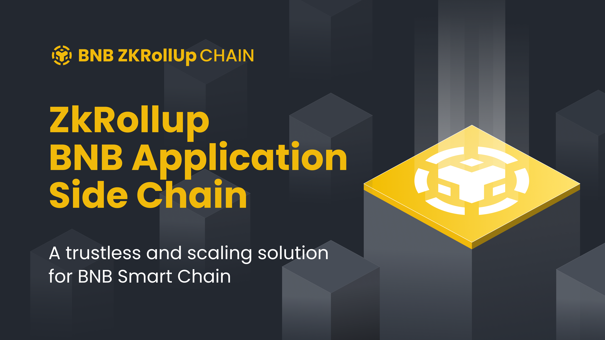
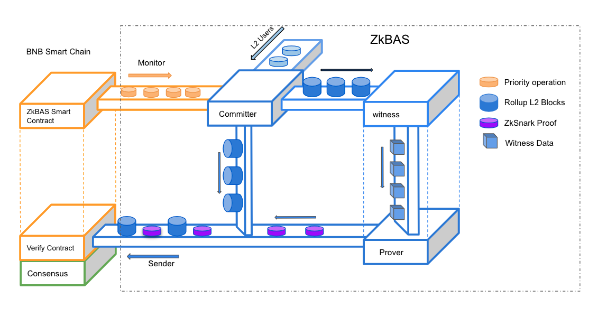

# BNB-ZKRollup Contract



The smart contracts on BSC(Layer1) for ZkRollup BNB Application Side Chain.

## What is BNB-ZKRollup Contract

The ZkRollup BNB Application Side Chain(BNB-ZKRollup) is an infrastructure for developers that helps them to build large scale
BSC-based apps with higher throughput and much lower or even zero transaction fees.



The above framework shows that the `BNB-ZKRollup-contract` is one of the core components, it is the entrance and exit of L2
ecosystem. `BNB-ZKRollup-contract` achieves that:

1. **L1 security**. The [BNB-ZKRollupVerifier Contract](./contracts/BNB-ZKRollupVerifier.sol) can verify the SNARKs proofs(succinct non-interactive argument of knowledge)
   that generated by Layer2 and so that we can prove the validity of every single transaction in the Rollup Block. So the BNB-ZKRollup share the same security as BSC does. Thanks to zkSNARK proofs, the security is guaranteed by
   cryptographic. Users do not have to trust any third parties or keep monitoring the Rollup blocks in order to
   prevent fraud.
2. **L1 to L2 Communication**. The [BNB-ZKRollup Contract](./contracts/BNB-ZKRollup.sol) expose several interfaces to
   support BNB, and BEP20/BEP721 created on BSC or BNB-ZKRollup can flow freely to BNB-ZKRollup.
3. **L2 to L1 Communication**. Each `Rollup L2 Block` including a batch of `L2 operation` that need to be processed by L1
   contracts.
4. **"Full exit" on BSC**. The user can request through L1 smart contract to withdraw funds if he thinks that his transactions
   are censored by BNB-ZKRollup.

## Getting Started

### build && test

```
yarn install
npx hardhat compile
npx hardhat test
```

### The deployed contracts on testnet and mainnet(coming soon)

## Design

### BNB-ZKRollup Key Contracts

- [BNB-ZKRollup](./CONTRACTS_DESIGN.md#BNB-ZKRollup)
- [AdditionalBNB-ZKRollup](./CONTRACTS_DESIGN.md#AdditionalBNB-ZKRollup)
- [AssetGovernance](./CONTRACTS_DESIGN.md#AssetGovernance)
- [BNB-ZKRollupVerifier](./CONTRACTS_DESIGN.md#BNB-ZKRollupVerifier)

### BNB-ZKRollup Name Service

- [ZNSRegistry](./CONTRACTS_DESIGN.md#ZNSRegistry.sol)
- [ZNS](./CONTRACTS_DESIGN.md#ZNS.sol)
- [ZNSRegistrarController](./CONTRACTS_DESIGN.md#ZNSRegistrarController.sol)
- [ZNSResolver](./CONTRACTS_DESIGN.md#ZNSResolver)

### Upgradeable Design

- [DeployFactory](./CONTRACTS_DESIGN.md#DeployFactory)
- [UpgradeGatekeeper](./CONTRACTS_DESIGN.md#UpgradeGatekeeper)
- [Proxy](./CONTRACTS_DESIGN.md#Proxy)

## License

`BNB-ZKRollup-contract` is released under the [Apache License, Version 2.0](https://www.apache.org/licenses/LICENSE-2.0).
